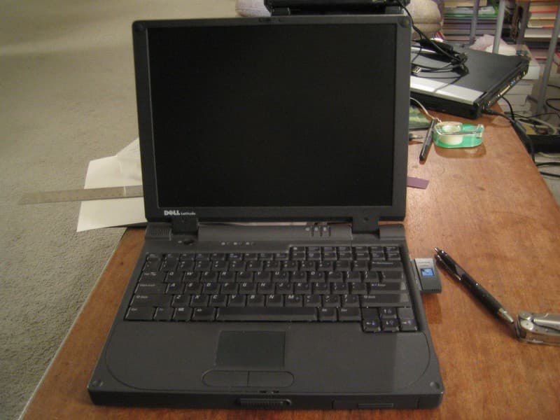
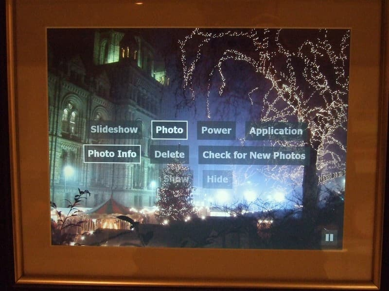
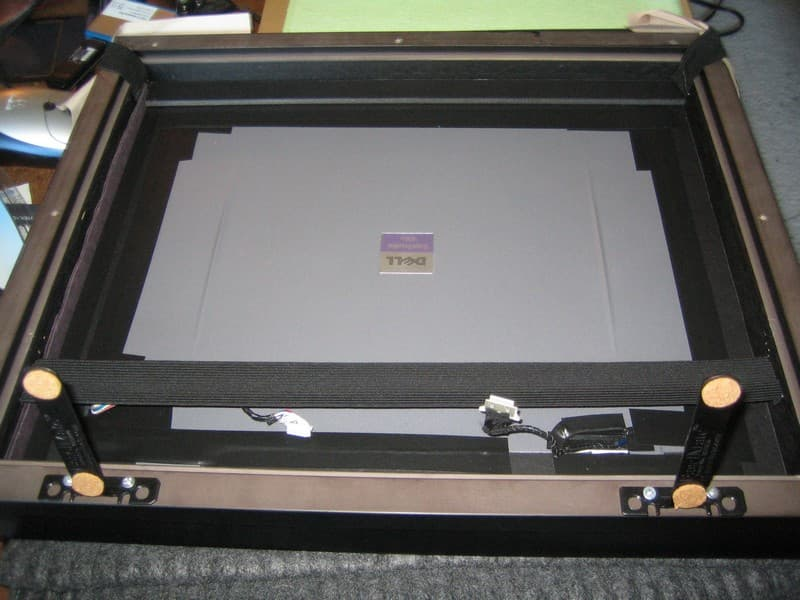
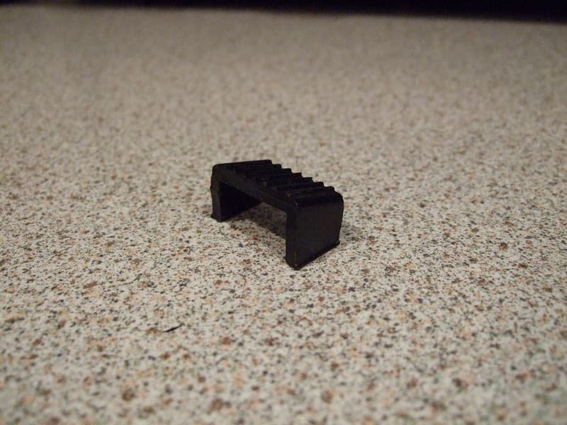
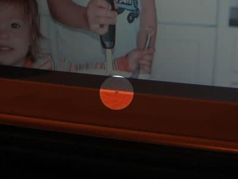

Yes, it’s yet another laptop picture frame build log.  Why bother when there are already tons of these documented on the web?  Well, when I put this picture frame together back in 2007, I had some requirements that I hadn’t seen tackled in other projects:

* Wireless internet connection so it could automatically download new pictures when I or my siblings upload them (when I started, commercial WiFi-enabled frames weren’t available)

* Hard drive so the frame could store thousands of photos and continue to work even when it wasn’t connected to the internet

* Software that could automatically update itself and provide remote access, since the frame would live 5,000 miles away

* Wireless remote and custom on-screen interface to make it easy to navigate the photos and control the frame

I was building the frame for my parents, who were living in London at the time.  My eldest sister and her kids were living in New York, so it seemed like making it easy for her to share photos of the grandkids would be handy.  Thus it was important to have some way to upload pictures to the cloud and then have them automatically appear on the frame.  At the same time, I didn’t want the frame to be completely dependent on an internet connection, since my parents’ WiFi was kind of flaky, so having the photos stored on a hard drive was vital.  And given that I was living even farther away than my sister, the software would have to be able to update itself, since I wouldn’t be able to pop over for tech support.

So the solution I settled on was to strip down an old laptop, build it into a custom-made frame, and then run my own custom software to download and display the photos.  Four years later, the picture frame is still running just fine, having downloaded 3,937 photos so far (which I can tell from the logs it uploads every day).

## YALPF EOL

Actually, not anymore, sadly.  After they moved back to the States, my parents had the frame in their house in New Jersey, and this is what Hurricane Sandy did to it in 2012:

Unfortunately, waterproofing was not one of the features I’d thought to add.  So no more LCD picture frame.

Anyway, read on for all the gory details of how it *used* to work.

## Selecting the hardware

At first I thought I’d need to build the picture frame from individual components: a Mini-ITX motherboard connected to an LCD screen and drive, maybe running some really minimal Linux distro.  But as I started researching LCD panels, I came across lots of DIY picture frame projects using old laptops.  Well, duh, why didn’t I think of that?

As it happened, I had an eight-year-old old Dell Latitude CSx lying around unused. It wasn’t terribly useful as a laptop since its battery didn’t hold much of a charge, but the picture frame would be plugged in all the time, so power wouldn’t be an issue.

The laptop had a number of advantages for this project:

* Free!

* Fairly compact for an old laptop (it didn’t have an internal CD drive): 12" X 9 3/16" X 1 1/2"

* 1024 X 768 screen, which is exactly the same as the “large” size of Flickr photos

* No stuck pixels and no scratches on the screen

* Fairly clean install of Windows 2000, which had been running fine for years

* Relatively cool-running Mobile PIII, which is good, since air flow was going to be a challenge

* A compact, single motherboard

As well as some disadvantages:

* The screen wasn’t as bright as those on new laptops and the viewing angle, especially vertically, was narrow

* The display was only 16 bit color

* No built-in WiFi, so it required a PC Card, which meant the frame had to be somewhat larger to accommodate the card’s antenna sticking out of the side

* No temperature sensors on the CPU or motherboard, so I couldn’t tell how hot it was running once inside the frame

* Only a single USB 1.0 port

* An annoying crackling sound that I think emanated from one of the capacitors around the CPU (it wasn’t the speaker, which I disconnected); it seemed louder than the drive, and is noticeable in a quiet room

Still, the “free” part tipped the balance, and even with only 256MB of RAM and a 500Mhz P3, the laptop had sufficient horsepower to download photos and display them.

(Note that this picture was taken after the laptop was already installed in the frame.  To get into the BIOS, I had to reattach the original keyboard, which was flopping out the back of the frame.)

## Writing the slideshow software

The first thing I started on was the code for downloading and displaying photos, as I figured it would be best to get everything working on the laptop before dismantling it.  Most of the laptop frame projects I’d seen focused on the process of ripping apart the laptop and fitting them into a picture frame.  The software was usually an afterthought.  Many simply used a screensaver to cycle through pictures that were loaded onto the laptop via a shared folder on the local network.  But the frame would live at my parents’ flat in London, 5,000 miles and 8 timezones away.  So auto-updating, reliable code was going to be crucial.

Like most software projects, the slideshow app took longer than planned, about 4 months of weekend coding.  I considered a number of approaches, from scripting an app like IrfanView in order to display the pictures sequentially to building an app with the first version of Adobe AIR, which was in prerelease at the time.  Given the time constraints (I was trying to finish the frame in time for Mother’s Day), my existing skillset (great with JavaScript, not so much with ActionScript, and my C++ was very rusty), as well as the need to interact with the OS (I wanted to turn off the screen at night, reboot Windows periodically, etc.), I finally settled on a combination of technologies:

* JavaScript running in an HTML file with a `.hta` extension, which turns the page into an [**HTA**](https://msdn.microsoft.com/en-us/library/ms536496%28v=vs.85%29.aspx), letting the script run command line utilities and access the local filesystem

* The MochiKit [**Deferred**](https://mochi.github.com/mochikit/doc/html/MochiKit/Async.html) library to handle asynchronous calls to web services

* A custom JavaScript library to wrap the [**Flickr API**]( https://www.flickr.com/services/api/)

* A custom **ActionScript 3** movie that simply displays a local image file, since Flash does a much better job of down-sampling pixels than the IE engine used in the HTA

* [**Windows Script Files**](https://msdn.microsoft.com/en-us/library/15x4407c%28v=vs.85%29.aspx) to script the unzipping and launching of new builds

* Command line utilities like [**nircmd**](https://www.nirsoft.net/utils/nircmd.html), which lets batch files do things like turn off the monitor or restart Windows, and [**wget**](https://gnuwin32.sourceforge.net/packages/wget.htm), which is used to download images from Flickr

While this probably looks like an unholy mess, cobbling together existing tools let me focus on writing the code that handled the core functionality.  5000 lines of JavaScript later, I actually had a pretty reliable system that would automatically download new photos from Flickr, display them in slideshows, and update itself when it detected a new version.

## The picture frame OS

The basic control flow of the picture frame’s “operating system” goes something like this:

* After Windows boots, a `.wsf` script runs to check whether a new build has been downloaded, and if so, it launches that `.hta`. Otherwise, it falls back to the last-used build.  (Each build is downloaded and unzipped to a new directory.  I don’t worry about cleaning up old versions, as there’s plenty of free drive space.)
* When the `.hta` starts, it saves its path so that the startup script can tell that the build works.  It also sends a heartbeat ping to my server, so I can tell that the frame is up and running.
* Every 20 minutes, send another heartbeat ping.  If the server sends a response to the ping, evaluate the response, which is a handy way to remotely query the frame and have it perform different actions.
* Every hour, do the following:
   * Check for new photos from my and my siblings’ Flickr accounts.  If there are any, then query the Flickr API for the available sizes for each photo, create a new folder to store them, and use `wget` to download the large size of each one into the folder.
   * Check the server for a new build.  If there is one, download and unzip it, then call the `.wsf` to restart the `.hta`.
   * Create a new semi-random slideshow which will be displayed over the next hour.
* At 1am every day, turn the screen off (I couldn’t get the laptop to wake up if it went into actual sleep mode).  At 7am, turn the screen back on.
* At 2am every day, upload the local log file to my server.  This helps me debug any problems while the frame is on the other side of the world.  The logs include messages written out by the JS code as well as a dump of all the processes running on the machine and the amount of memory they’re taking, so I can remotely check the slideshow’s RAM usage.
* At 3am every day, restart the `.hta`, to deal with memory leaks in IE6/Flash. And once every 3 days, restart the whole OS, to deal with leaks and instability in Windows.

I didn’t want the slideshows to simply be a random collection of images.  Rather, I wanted the picture frame to make it more likely that my parents would notice new photos as soon as they’d been uploaded to Flickr.  So the slideshow is built using these rules:

* Select enough photos to show a new one every 10 seconds for the next hour.

* Photos that have been downloaded within the past 24 hours are added to the slideshow in order, so they’re more likely to be seen as soon as they’ve been downloaded.

* Photos that have been downloaded within the past week are added in order once every 4 hours, on the assumption that my parents haven’t gotten bored with the recent photos yet.

* Fill 1/4 of the remaining photos in the slideshow with photos that are less than 2 months old in random order.

* Fill the rest of the slideshow with older photos.

By constructing the slideshow in this way, newly uploaded photos are displayed frequently and in order, so that they’re more likely to be seen in the same order they were shot.  If there aren’t any recent photos, then the picture frame will dig into the archives and pull out a random assortment of older ones.  There’s also an option in the frame’s UI (described below) that starts a new slideshow showing all the photos in order, from the newest folder to the oldest.

There wouldn’t be any pretty transitions because I didn’t want to stress the CPU and thereby increase the heat issues, and I wanted it to behave more like a regular picture frame, which just shows static pictures.

## Using the on-screen interface

The on-screen UI and remote control support was some of the last functionality I added, but I’m not sure why I ever thought it might be unnecessary.  If you’re looking at a photo and want to pause for a moment, or skip over a boring photo, or delete an ugly one, it’s incredibly handy to quickly bring up a menu without having to fiddle with a mouse or keyboard.  It makes the frame feel like an appliance rather than a computer.

I investigated various approaches to controlling the picture frame’s software.  I connected a wireless mouse in order to drive Windows, but I wanted viewers to be able to stand back and still interact with the slideshow.  I didn’t want an IR port visible on the front of the frame, so an RF remote seemed like the best solution.  Presentation remotes for controlling PowerPoint were widely available and had just enough buttons to provide useful functionality, without being overwhelming.

The first remote I tried was a cheapie Targus, because I wasn’t sure I was going to actually need one.  It was useful for testing, but it had a couple drawbacks: the power button was hard to notice and fiddly to use, it ran through batteries quickly, it had a superfluous laser pointer, and one of the buttons triggered an alt-tab keystroke, which would be useless with the frame. Still it worked well enough to convince me that having a remote control would be vital, not just to quickly switch between photos but also to operate an on-screen menu to do things like shut down, check for new photos, etc.

This is the remote I end up using:

It has 5 buttons, no laser, no off switch and apparently has pretty efficient battery usage.  In reality, though, it only has 4 useful buttons, since the ESC button, while it does send an esc key event, does so only after you hold it down for 3 seconds.  That makes sense in a PowerPoint preso (you don’t want to accidentally exit the presentation), but isn’t useful as a regular button.  I end up assigning it a shutdown function: when held down for 3 seconds, it’ll shut down the entire frame.

I use the bottom button, which sends a “b” keycode (to switch to a blank frame in a preso), to bring up and dismiss the menus.  When the menu is visible, the left and right buttons (page up and page down keycodes) move horizontally through the menu options.  The middle button (an F5 keycode) selects the highlighted menu item, which may bring up a second level of menus or activate the highlighted command.  While a slideshow is active and the menu is not shown, the middle button does double-duty as a pause button.

The hierarchical menus are specified with a JavaScript object.  Each menu object can have a submenu, submenus can have submenus, and so on.  When an item that has a submenu is highlighted, the submenu items are displayed semi-transparently.  When it’s selected with the middle button on the remote, the submenu becomes fully visible and its first item is highlighted.  The user interface is pretty barebones, but it gets the job done.

## Storing the photos

When the slideshow software sees that new photos are available on Flickr, it creates a folder named with the current time and date.  A batch file is created that contains the URLs for the 1024x768 versions of the photos on Flickr, and then wget downloads each one.  The file structure is pretty simple, but it’s sufficient to handle thousands of downloaded images.

Each folder also contains a JSON file that stores the metadata of the photos, including their captions and upload dates.  This date is more useful than the date the photo was taken because I want to bias the slideshows towards showing newly available photos.  If I find some old pictures taken two years ago and upload them, those should still be considered “new” photos.

So that pretty much does it for the software.  The next step was to put the laptop on a diet so it would fit inside the frame.

## Laptop teardown

First things first.  Let’s peel off the little rubber bumpers around the edges of the lid and see what we’ll need to do to get the screen off.

Just your basic Philips head screws.  Guess I won’t need that Torx screwdriver bit set I just got at Fry’s. :|

Okay, that wasn’t too bad.  Next up are the screen hinges.  Pulling off a little plastic piece reveals the mic and the screws that attach the hinge to the base of the laptop.

Another plastic bit snaps off between hinges, revealing some LEDs and the screen power, display and keyboard connectors.

Removing a couple of screws releases the keyboard, which can then be unplugged from the motherboard.

I keep rough track of all those little screws, since so far I haven’t done anything irreversible to the laptop, and I might want to put it back together.

Here’s a close-up of the screen display data connector, to the left of the keyboard connector:

The screen data and power connectors will get a real work out over the next couple weeks as I disassemble and reassemble the components inside the frame several times.

Once these cables are disconnected, it’s just a matter of removing the 4 screws that hold the hinges to the base, and the laptop is now successfully decapitated.

The plastic frame that forms the top part of the laptop base has been unscrewed.  The speaker and mic cables are still connected in the top-right corner.

The laptop’s naked bottom:

## Disaster strikes

Before I do any more damage, I reconnect the screen, put the WiFi card back in and power up the laptop to see if it still works.

Indeed it does.  The slideshow software runs fine.  I take a couple pictures for posterity, first without a flash...

...and then one with...

...which immediately causes the screen to turn milky white.  Holy crap, what did I do?  I really wish I’d taken a picture of the screen in its screwed up state, but I’m too busy cursing my stupidity, although who knew a camera flash could harm an LCD?  (I still haven’t been able to find any information online about such a phenomenon.)  The display is still running, since you can sort of see the colors shifting as the slideshow changes pictures, but it’s mostly a cloudy white.

I’m sure I’ve killed the screen, which would put a quick end to the project.  But I calm down, turn off the power (no way to shut down without being able to see the screen), let it sit for a minute, and turn it back on.

Phew.  It still works!

I still have no idea what happened, since I’d taken previous flash pictures with the screen on and it was unaffected.  I can only guess that the bright light overloaded something in the circuitry that was usually covered by the frame around the display, which caused it to turn on all the pixels, or something.  Anyway, the moral of the story seems to be to not take flash pictures of your naked LCD screen.

## Designing the frame

Now that the laptop is stripped down I can get more accurate measurements of the base and screen, and start to figure out how they’ll fit together inside the frame (the dial calipers I just bought at Home Depot come in handy here).  This is a critical step, since I want the frame to be as compact as possible, but if I make it too small, the laptop pieces won’t fit.  I’m also under some time pressure (always a good motivator) since it’s only a few weeks before a planned trip to London, and having the frame custom made will take a couple weeks.  I want to *finally* have the picture frame done before the trip so I can carry it on the plane instead of shipping it (plus it’ll probably be easier to set it up in person than trying to talk my parents through it over the phone).

So given all that, I naturally screw up the measurements.

Well, not so much the measurements as figuring out how the pieces will fit together.  The active area of the screen is slightly less than 10 5/8" X 7 15/16", so that will be the size of the opening in the mat board, just small enough that there shouldn’t be any black around the pixels making up the image.  I then need to figure out the placement of all the other components in relation to the screen, which itself should be positioned in the middle of the frame.

The WiFi card’s antenna sticks out 1 1/8", so I decide having 1 1/4" on each side of the screen opening will suffice.  The power connector sticks out from the back of the laptop (which will be at the bottom of the frame); an additional 1 1/2" at the bottom should be enough space to accommodate it and the power cord.  The screen and lid is 5/16" thick, and the tallest part of the metal base is about 1 1/2", so I figure I’d need at least 1 3/4", plus the thickness of the mat and glass, for the frame’s “[rabbet](https://en.wikipedia.org/wiki/Rabbet)”.

I end up with internal measurements for the frame of 13 1/8" wide by 11 3/4" tall by about 2" deep, and I take the numbers to [The Great Frameup](https://www.thegreatframeup.com/) in Menlo Park.  Unfortunately, it’s difficult to find frame stock that is both deep enough and nice-looking.  To fit my parents’ décor, I want something that looks like a traditional frame, not just a simple black rectangle.  I do find some carved black frame stock that I like, but which I don’t think is deep enough, so I end up choosing a straight-edged brown frame that has a 2" rabbet.  The mat will have 1 1/4" around the left, top and right of the screen opening, but 2 1/2" at the bottom, to accommodate the power cord.  It ends up being a little more spendy than I’d hoped, but I don’t have the tools for building a frame (never mind the mat and glass) and I figure I might as well do it right.

I don’t love the idea of an asymmetric mat, so I go home and mock it up with some cardboard for the frame and construction paper for the mat (it’s craft time!).

The asymmetry doesn’t look too bad, but mocking it up helps me realize that I was wrong about some of the measurements.  I left 1 1/4" around the screen opening (10 5/8" wide), but the lid is actually 12" wide.  Then again, I only need the extra space on the right side, where the WiFi card sticks out.  I also need 1 1/2" only on the bottom of the laptop base, whereas the top (normally the front of the laptop) can be right up against the inner part of the frame.  It’s time to do some more prototyping.

A key constraint in fitting the laptop into the frame is the length of the cables connecting the base to the screen.  The laptop will basically be folded back on itself, with the bottom of the base flush against the back of the screen.  I need to find a way to position the two pieces so that the very short cables still reach the base (trying to fashion some sort of extender cable is beyond my electronics capabilities, and simply cutting the cables and patching in new ones seems liked a good way of killing the screen).

Another important question is how to support the laptop components inside the picture frame.  A Channel 9 article that I read suggested that it’s simplest to just use the laptop’s own case to hold the motherboard in place, since it’s custom-designed to do just that.  So I figure I’ll use the metal base (magnesium? I’m not really sure what it’s made of) and leave the motherboard screwed into it.  I’ll also use the back of the lid (also metal) to support the screen, which is a little flimsy without some kind of frame to support it.

The problem is that the screen cables are too short to simply wrap around from the front of the screen to the keyboard side of the base (which will be at the “back” of the picture frame), so I’ll need to figure out how to shorten that distance.  It looks like I’ll need to cut some notches into the lid so that the cables have a shorter distance to travel.

To be sure I have the measurements right, I cut out a piece of cardboard exactly the same size as the lid and cut some notches into it for the cables.  I pull the lid off the screen (there’s some double-sided tape holding the two together) and place the screen face down on a soft microfiber cloth.

Then I put the cardboard on top where the lid would go, and the laptop’s base on top of that.  I center the width of the base plus the WiFi antenna on the width of the screen and the height of the base plus space for the power cord on the height of the screen.

With the notches cut into the prototype lid, the power cable reaches its plug on the motherboard, but the display cable doesn’t quite reach.  I’m going to have to cut part of the base away.  Removing the metal above the rear connectors will reduce the distance the data cable has to travel, letting it reach from the screen to the base.

At this point I redo all the measurements and draw a basic blueprint in Illustrator to make sure everything will fit together correctly right this time.

The blueprint confirms that the frame can be made shorter and slightly wider, which means that the border around the mat opening can be symmetric.  If I cut away part of the base, I should be able to make the laptop components fit within the 1.5" rabbet of the black frame stock I’d originally wanted to use.

So I go back to the Great Frame Up and change my order.  It turns out that using the black stock for the frame will actually be about $50 more than what I originally chose.  But the manager there doesn’t want to deal with the paperwork of changing the price, so he waives the difference (thanks!).

## Modding the laptop lid

Now that the frame is in production with just a couple weeks before the trip, it’s time to actually start cutting up the laptop components to fit inside the frame.  First to go under the knife is the lid.  I haven’t done any metal or even wood cutting since an architecture class in college, and I’m sorely lacking in power tools.  But that’s nothing a trip to Home Depot can’t cure.

Ah, the Dremel.  Every case modder’s favorite tool.  I manage to cut the first notch, next to the hinge, without losing any fingers, but damn is dremeling metal loud.

So I try cutting the notch for the power cable using a nibbler, which is slow but quiet, and actually produces a somewhat cleaner cut (which may be due simply to a lack of Dremel skillz).

A little rough but acceptable.  I file the notches and wrap them in electrical tape, and then reassemble the screen and base.

The power cable does indeed reach now.

## Detaching the motherboard

Next I need to cut away part of the base, both to help the display cable reach the base and to make the base thinner.  Of course, I’ll need to remove the motherboard from the base before making any cuts, which involves removing a whole bunch of screws.  All those screws will have to be put back in the right place to reattach the motherboard, so I keep track of where they go by taping them to a sheet of paper, with callouts labeling their original locations.

Connected to the metal RF shield are some heat sinks for the CPU and some other chip (the southbridge?).  The heat sinks are connected to the chips with some junky thermal pads, bits of which remain on the CPU.  A little rubbing alcohol will remove the pads, but I’ll need to apply some thermal compound before reattaching everything.

The trackpad plugs in to the motherboard via a short cable and a weird little connector.

Here’s what the back of an old Synaptics trackpad looks like.  It’s got a snazzy brown-and-gold motif.

33 screws later, the motherboard is separated from the base.  It’s surprisingly small and compact compared to the multiple boards often used in more modern laptops.

Here’s the base sans motherboard:

Note the handwritten revision number:

The battery compartment (the raised bit on top of which the trackpad sat) is another part of the base that I want to cut away.  I won’t use the battery in the frame and the compartment is taller than any of the components on the motherboard.  So removing it should make the base thinner and will also free up some space to add a couple small USB devices as described below.

## Cutting the base down to size

Given how neighbor-annoyingly-loud cutting metal is, I didn’t want to Dremel the base at home.  At the 2007 Maker Faire, I found out about a place called the [Tech Shop](https://techshop.ws/), sort of a gym for DIY nerds.  You can join for a day, month or year at a time and get access to all of their tools and equipment: drill presses, band saws, milling machines, and whatnot.

In the Tech Shop’s metal shop, cutting the base and lid isn’t too hard, but it’s a little tricky to clamp the pieces down so they don’t vibrate as the Dremel bites into them.  To cut the battery compartment out, I end up using a couple of big C-clamps to fix the base to one of Tech Shop’s big work tables.

Here’s the base after an hour or so of cutting:

The battery compartment has been removed, leaving an L-shaped base beneath the motherboard and the hard drive.  I’ve also cut away the frame around the rear connectors and lopped off the little “towers” into which the screen hinges were screwed, on the right side facing the back of the laptop.  I thought they’d be hard to cut since they’re so thick, but the Dremel conquers all.

The base is now only as tall as the components on the motherboard and doesn’t have any extraneous metal bits sticking up.

I also decided I need to cut further into the lid to reduce the distance the display cable has to travel.  Here’s the lid after enlarging the notch near the hinge and wrapping it electrical tape:

This is another bit of dremeling I needed to do.  The over-designed Dell power connector has a flange sticking up from the top, I guess to make it easier to pull out.  The flange would add about 1/4" to the height of the base, so it’s got to go.

After thoroughly cleaning the filings off the base and lid (metal dust and PCBs are not friends), I put almost all the screws back in to reconnect the motherboard to the base (“almost all” because I leave off a few extraneous case bits).

Before reattaching the heat sink/RF shield, I apply some Arctic Silver thermal compound to the CPU and whatever the other chip is.  Unlike modern heat sink mounting brackets, the only thing pressing the heat sinks to the chips are some screws that don’t seem to apply much pressure.  Once they’re all tightened, there still seems to be a small gap between the heat sink the mystery chip (I can see the RF shield bend slightly when pressing where the heat sink is attached).  I should probably use a thermal pad instead of compound to bridge the gap, but Fry’s didn’t have any (who uses thermal pads anymore?) and I’m running out of time, so I’ll just hope that the chip can survive without tight contact with the heat sink.

I put the screen back into the lid, face down.  With the notches cut, the power and display cables can now exit the back of the lid instead of through the hinges.  Hopefully they’ll reach the connectors now.

I screw in the hard drive caddy and pop in the WiFi card.  Then I position the base on top of the lid where it’ll be in the frame.

Success!  The power and display cables from the screen now reach the connectors.

I disconnect the cables, flip the lid over, reconnect everything, plug in the power and boot her up.  Fortunately, the laptop seems to still be in working order.

Now I need to figure out how to secure the screen and base inside the frame.  The Channel 9 article suggested cutting a piece of foam core to surround the screen and support it right behind the mat board.  They screwed the motherboard to a large piece of particle board, but I figure I can use foam core to support the base as well.  With the foam supporting the pieces vertically, I’ll also need to devise some way of preventing them from flopping out the back of the frame.  There’ll be a backing on the frame, but the screen needs to be pressed up tight against the mat board, even when the frame is angled back a bit on the [Easelmates](https://www.unitedmfrs.com/cart/detail.cfm?item=4894) that will be attached to the frame’s bottom.

First I get a piece of black foam core and cut out a rectangle exactly the same as the internal dimensions of the frame.  The foam core is a little less than a quarter inch thick and the screen plus lid is a little more, but it seems like it should be thick enough to support the screen.  To position the screen’s pixels exactly in the middle of the frame, I pencil in a 10 5/8" X 7 15/16" rectangle centered on the piece of foam core.  Then I draw the outline of the lid around the screen area; the top sides and bottom of the lid each have different widths, and I have to account for the hinge pieces sticking down as well.  Once that’s done, I carefully cut out the outline with an Xacto knife.  It’s important to make the cuts as precisely as possible because this foam core is responsible for positioning the screen behind the mat board.  If it’s off a bit, I’ll end up with parts of the screen’s frame showing through instead of pixels.

Here’s the plastic inner part of the lid placed in the foam core to check sizing:

Looks pretty good.  Once I get the frame back and make sure everything fits, I’ll tape the screen to the foam so it doesn’t slide around.

I decide to use foam core to support the base as well.  The cuts here don’t have to as precise, since no one will see the base.

The little notch cut out of the lower-left corner of the L-shape is to let the power cable pass through from the screen to the base.  The weird angled notch on the lower-right is to accommodate the round noise filter on the power cable, which is about 3/4" thick.  I don’t want it to stick above the base, so the notch lets it sit lower.

I bring these pieces and the laptop base into the frame store because they want to make sure everything fits in the frame.  A couple days later, I eagerly pick up the finished frame &mdash; and immediately notice a couple things wrong.

They fixed the glass, mat board *and* my carefully cut foam core support into the frame, so it can’t be removed.  They also cut the bevel on the mat board opening so that it wouldn’t be visible from the front.  This was because the mat board is a very light gray, but the interior of the board is noticeably whiter, and they thought it might be distracting to have the white line around the display.  Hmm.  And finally, they screwed the particle board on the back of the frame to the frame itself.  The original idea was to attach a metal rim to the frame that would allow the back to slide down into the rim, so it wouldn’t be permanently attached.

Anyway, I leave those issues aside for now and bring home the frame for a trial run.  Here’s a shot of the frame from the back, looking out through the glass:

You can see the staples holding the foam core, mat board and glass into the frame.  The black straps are pieces of elastic bands that are intended to press the screen and base up against the glass, while still allowing them to be inserted and removed.

## Assembly test run

First I use electrical tape to attach the screen to the lid so they don’t come part.  It should also avoid any further issues with camera flashes messing up the screen.

Naturally, the screen goes in first.

Then the white foam core and the motherboard.

The elastic bands aren’t quite tight enough to hold everything in firmly, hence the cardboard kludge over the hard drive to keep the pieces pressed against the mat board.

Everything’s connected and plugged in.  Time to fire her up.

Ah, yes.  The Windows 2000 progress bar has never looked so good.

One issue that’s immediately apparent is that the screen is sitting too low, leaving a black bar above the image.  Since it’s not attached to the foam core, it must have shifted down a bit.

I’m also not loving the reverse bevel since you can see black around the screen if you look at the frame from an angle.  So the next day I bring the frame back to the store and ask them to recut the mat board with the bevel facing front, which they do for free.  They also tack just the mat board and glass into the frame, leaving the foam core separate, and tighten up the elastic bands.  With just a couple days to go, I’m ready for final assembly.

## Final assembly (or so I think)

I use more electrical tape to secure the screen to its foam core support to keep it from sliding off.

I also place some foam spacers on the back of the screen to hopefully give it a little breathing room.  The back of the base (facing the screen) seems to get pretty hot after it’s been sitting in the frame for awhile.  I’m hoping that the extra foam core won’t make the stack of components too thick.

The foam core support for the base has been getting a work out and the couple places where it gets very narrow have started to bend.  So I cut an identical piece from the black foam, which looks cooler anyway.

The base’s support goes in next.  I cut a couple notches at the top to hopefully let some of the heat from the screen to escape, but who knows how effective they’ll be.  I don’t just cut away the entire upper-right corner because I want to attach a USB hub there.

The motherboard and laptop base are now nicely cradled by the foam core.

The laptop has just a single USB 1.0 jack, so I need to add a small hub to accommodate the RF dongles for the wireless mouse and the presentation remote that will be used for controlling the slideshow.  I attach the silver USB to the foam core with some double-sided tape.  Due to heat rising from the CPU, the tape turns out to be wholly inadequate.  I eventually end up wrapping electrical tape completely around the hub and the foam core in order to secure it.

The plugs on most USB cables are close to 1 1/2" long, which would be a tight fit at the bottom of the frame.  So I go to Pacific Custom Cables to look for a solution.  Their [right angle connector](https://www.pacificcable.com/Picture_Page.asp?DataName=USBAMRAF-3IN) is exactly what I need; too bad it came in a ginormous DHL box.  The connector is just visible peeking out from under the elastic band at the bottom of the frame.

I probably should have ordered a custom version of the right-angle cable that would be long enough to reach all the way from the USB jack to the hub, but I didn’t think I’d get a custom part in time.  To avoid having a lot of excess wire stuffed into the frame, I use a ZipLinq cable adjusted to the length I need.  The lower-right corner of the frame is a little crowded, with the USB connector, ZipLinq spool and power cable, but everything ends up fitting.  This picture also shows the round noise filter on the power cord fitting into the notch in the foam core.

To keep the Easelmates from scratching whatever they’re sitting on, I stick some little self-adhesive cork pads to the bottom.

I notice that the Easelmates do a good job of keeping the frame from tipping backwards, but nothing is stopping it from tipping forwards, which would make a mess of things.  So after poking around Home Depot, I buy a couple of small rubber doorstops, chop them down so they’re just the right height to fit under the frame, and spraypaint them black.

When the doorstops are tucked under the black frame, they’re hardly noticeable.  The frame would now need a pretty serious shove to topple forwards.

The elastic straps do a decent job of pressing the stack of components up against the mat board, but they’re a little awkward to work around when getting things in and out of the frame.  A better idea would probably have been to use some sort of Velcro strap and buckle affair.  The buckle would be attached to one side and the strap to the other.  The strap would go through the buckle and then fold back against itself.  This would enable the strap to be tightened up against the components but would also let it stay completely out of the way when putting things into the frame.  In any case, not having the components be permanently attached is definitely a good thing; I’ve already inserted and removed them a couple times, and will have to do so a few times more.

With everything in place, I plug in the frame and power it up.  The screen looks like it’s centered vertically now, which is a good thing.  But looking more closely, it’s a hair too far to the right.

And I notice in the upper-right corner that I covered a few pixels with electrical tape.  Gah.

## Final, final assembly (I hope)

So I pull out the base, its foam core and then the screen.  I pull off some of the tape and shift it a bit so it doesn’t cover any pixels.  Then put everything back in again.  To force the screen over to the left a bit, I fold a strip of construction paper over a couple times and slide it between the frame and the left side of the screen’s foam core (when looking at it from the back).

Something I’ve avoided dealing with up to this point is figuring out how I’m actually going to turn the damned thing on.  If I had more than the most minimal of soldering skills, I’d unsolder the power switch from the mother board and relocate it to the edge of the frame, soldering a cable in between, or solder in a brand new switch.  But I’m afraid I’ll trash the motherboard if I attempt any of that, so I’ve been hoping to use the laptop’s original power button somehow.  It’s basically just a metal button and spring that sits in a plastic cylinder.  When the button is pressed, a little plunger sticks out the bottom to press the switch on the motherboard.

I’ve viciously hacked the button out of the plastic frame with the Dremel (as can be seen by the jagged hole it left), but careful application of the sanding wheel smoothes off the rough bits.

The question now is how to position the button precisely over the switch on the motherboard, which is only about 2mm wide (“2mm?  No one can hit an exhaust port that small!” “We used to bullseye wombats back in Beggar’s Canyon....”).  The button’s plunger has to not only be right over the switch but also suspended at the right height.  Too high and the plunger won’t reach the switch.  Too low and it’ll depress it all the time.

With all the components in the frame, I eyeball the height of the button positioned over the switch, and it looks like it should intersect the wooden backing.  So I need to drill a hole in the backing exactly over the switch.  It turns out that the fact that the frame shop screwed the back to the frame is actually an advantage; if the button is attached to the back, it’ll be in a fixed location.  The key is to make sure I drill the hole in the right place.

Time to get my triangulation on.  First I tape a sheet of paper to the bottom right of the particleboard back.  Then I whip out my trusty Kooh-i-noor compass from 10th-grade mechanical drawing class.  In one of the screw holes at the bottom right I position the pointy end of the compass and adjust it so the pencil end is right over the switch.  Then I position the compass in the corresponding screw hole in the back and draw an arc on the paper.  I repeat the process for two more screw holes.  Where the arcs intersect should hopefully indicate the center of the switch.

I do loves me some geometry.

With X marking the spot, I use a 1/2" bit to drill a hole through the back.  Looks like a bullet went through the particleboard, but it’ll do the job.

According to my trusty Stanley calipers, the plastic surrounding the button is .6" in diameter, so I need to widen the hole.  I use the sanding wheel on the Dremel to slowly enlarge it a bit at a time, frequently checking if I can push the button into it.

Finally the hole is just large enough that I can squeeze in the button.  It’s a tight enough fit that no glue is required.  A little permanent marker cleans up the missing paint around the hole.

I screw the back on to the frame, careful to thread the power cord through the slot for it at the bottom.  Not too shabby, if I do say so myself.  Almost looks like an actual, if retro, product (when was the last time you saw an electronic gadget sitting in a wood cabinet?).

Now we’ll see how well that business with the triangulation worked.  I stand the frame up and press the power button on the back.  At the bottom of its range I can feel it click the switch on the motherboard, so it should work.  The laptop base actually looks like it sticks above the frame about 1/8", which is probably due to the strips of foam core I put between the screen and the base.  But since the back is a bit warped at the bottom, it all comes together okay.

Et voilà.  All of the components are tucked into the frame, the back is screwed on and the power button works.  The screen looks nicely centered vertically, but I notice a line of black on the right side: I’d shifted the screen too far to the left when I shoved the construction paper in.  So I’ll need to fix that.

And as I look closer, I see a little foam core turd sitting at the bottom between the mat and the glass.  I’m going to have to pull everything out of the frame once again to remove that little bastard.  Grr.  Argh.

## Final, final, final assembly (for reals, this time)

So I unscrew the back and pull the base and screen out again.  A little compressed air blasts the foam core to whatever infernal hellscape awaits such troublesome detritus.  I then very carefully put the screen back, trying to avoid getting any cruft stuck between it and the glass.

I also take this opportunity to spray paint the silver screws black so they’re not so obvious.  Once they’re dry, I screw the back on, but leave the power cable unplugged, since it’s time to hop on the plane to England.  Swathed in bubble wrap, the picture frame with the guts of a laptop doesn’t seem to faze the ever-vigilant TSA folks.

## Setting up the frame in London

Once across the pond, I unscrew the back, reattach the power cord, plug it into an adapter (hoping the power supply was truly multi-voltage like it claimed), and boot everything up.  Fortunately, the plane ride didn’t seem to break anything, although the screen shifted a bit out of square, so I’ll need to remove everything yet again to jam some more paper in to level it.  Feh.

Once that’s all sorted, I need to get the frame to connect to the wireless network in my parents’ flat.  It’s some crazy enterprise Cisco access point that I seem to have to reconfigure every time I visit.  I eventually find the WEP key and then use the on-screen keyboard and wireless mouse to laboriously punch in all those hex digits.  This is where having a wireless keyboard would’ve been handy, but I didn’t think it was worth connecting one just to connect to the WiFi, since once it’s on the network, I’ll be able to remotely connect from a computer that has a keyboard.

With the WEP key entered, the frame finally makes contact with the network.  I check the log files on my server and see that the frame is sending its heartbeat pings and is checking for new photos to download.  Success!

